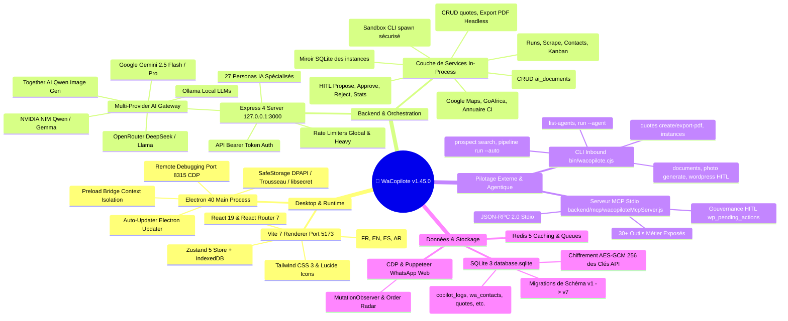
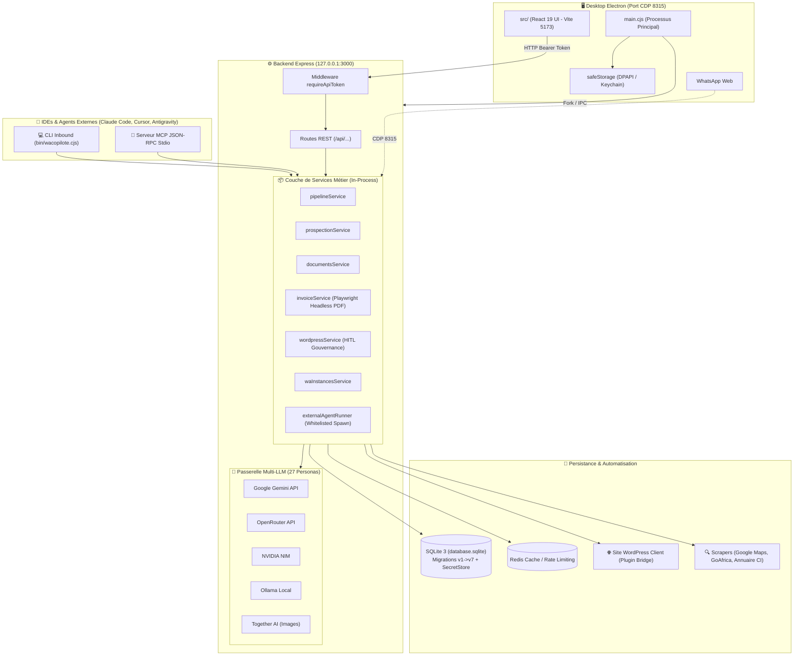

# 🧠 Carte Mentale & Architecture Globale : WaCopilote (v1.45.0)

## 📌 Vue d'Ensemble
**WaCopilote** est une suite logicielle SaaS Desktop & Agentique d'entreprise (Electron 40 + React 19 + Node.js 20 Express) conçue pour automatiser les flux de vente et de prospection WhatsApp, la génération d'images/catalogue IA, la facturation/devis, le bridge WordPress HITL (Human-in-the-Loop) et le pilotage bidirectionnel par agents IA externes (Claude Code, Cursor, Antigravity) via CLI et MCP (Model Context Protocol).

---

## 🗺️ 1. Carte Mentale Graphique (Mermaid Mindmap)

---

## 🔄 2. Diagramme de Flux de Données & Architecture Système

---

## 📂 3. Topologie Détaillée du Dépôt

| Répertoire / Fichier | Responsabilité & Modules Clés |
| :--- | :--- |
| `bin/wacopilote.cjs` | Point d'entrée CLI autonome pour l'orchestration système et le piping Unix. |
| `backend/mcp/` | Serveur MCP (`wacopiloteMcpServer.js`) JSON-RPC 2.0 exposant 30+ outils agentiques. |
| `backend/services/` | Logique métier extraite (pipeline, prospection, documents, devis, WP, instances, CLI runner). |
| `backend/routes/` | Wrappers fins Express avec rate limiting et token middleware. |
| `backend/agents/` | Orchestrateur des 27 personas IA (`orchestrator.js`, prompts système). |
| `backend/scrapers/` | Moteurs et parsers de prospection (Google Maps, Annuaire CI, GoAfrica). |
| `backend/db.js` | Driver SQLite avec interface mockée Postgres Pool, migrations v1->v7 et chiffrement. |
| `backend/secretStore.js` | Chiffrement AES-256-GCM au repos scellé par la clé maître. |
| `electron/` | Gestion du cycle de vie de l'application desktop, remote debugging CDP et updater. |
| `src/` | Interface utilisateur React 19, Zustand store, composants Radix/Tailwind, i18n FR/EN/ES/AR. |
| `docs/` | Documentation technique, schémas d'architecture et spécifications des ponts. |
| `wordpress-plugin/` | Plugin WordPress officiel pour la synchronisation e-commerce et le bridge HITL. |
